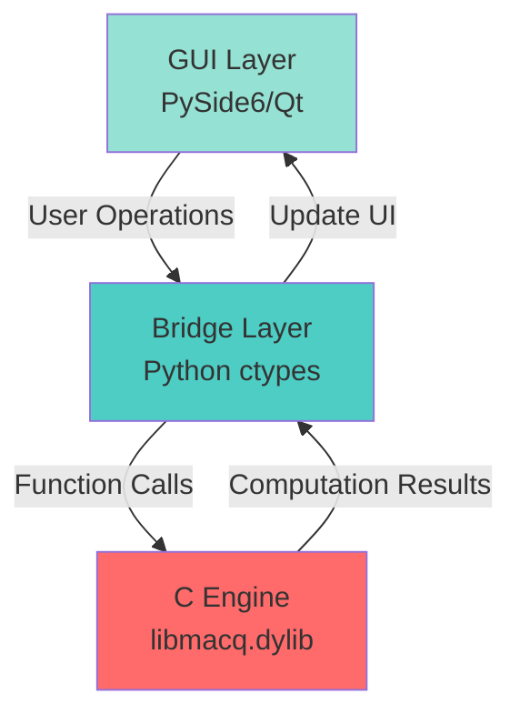

# MacQ: Mac-Native Quantum Computing Software - Complete Developer Guide

**Version**: 2.1  
**Last Updated**: January 29, 2026  
**Project Type**: macOS Desktop Application (C-Powered Core Engine)

---

## Table of Contents

1. [Project Overview](#1-project-overview)
2. [Core Architecture](#2-core-architecture)
3. [C Language Core Engine](#3-c-language-core-engine)
4. [Complete Quantum Gate Set](#4-complete-quantum-gate-set)
5. [GUI Visualization Components](#5-gui-visualization-components)
6. [Project Structure](#6-project-structure)
7. [Development Environment Setup](#7-development-environment-setup)
8. [Build and Deployment](#8-build-and-deployment)
9. [API Reference Manual](#9-api-reference-manual)
10. [Usage Guide](#10-usage-guide)
11. [Performance Optimization](#11-performance-optimization)
12. [Testing and Verification](#12-testing-and-verification)
13. [Troubleshooting](#13-troubleshooting)
14. [Development Standards](#14-development-standards)
15. [Future Roadmap](#15-future-roadmap)

---

## 1. Project Overview

### 1.1 Project Positioning

**MacQ** is a **high-performance desktop-native quantum computing simulation software** specifically designed for the macOS platform. It features a C language-powered core computational engine with a visual "block-based" programming interface, enabling users to intuitively build and execute quantum circuits.

> **Core Characteristics**:
> - ✅ **C Language Native Engine**: 100% pure C-written quantum state computation core
> - ✅ **macOS Native Application**: Not a web app, not a Python script, but a true desktop software
> - ✅ **Apple Silicon Optimization**: Integrated with Accelerate framework, GCD multi-threading, and ARM NEON SIMD acceleration.
> - ✅ **Qt Desktop Interface**: GUI layer built with PySide6 (Qt for Python)
> - ✅ **Zero External Dependencies**: Core engine requires no third-party libraries, only macOS system frameworks

### 1.2 Project Vision

To create the **most performant and interactive** quantum computing learning and prototyping tool on the macOS platform, filling the gap between professional-grade quantum simulation software and educational tools.

### 1.3 Application Scenarios

| Scenario | Description |
|----------|-------------|
| **Quantum Algorithm Teaching** | Visual drag-and-drop interface lowers learning barrier |
| **Algorithm Prototyping** | Rapid validation of quantum algorithm concepts |
| **Research Experiment Rehearsal** | Simulation before running on real quantum hardware |
| **Performance Benchmarking** | Evaluating complexity of different quantum algorithms |

### 1.4 Comparison with Other Quantum Software

| Feature | MacQ | Qiskit | Cirq | ProjectQ |
|---------|------|--------|------|----------|
| **Core Language** | C | Python | Python | Python |
| **macOS Optimization** | ✅ Accelerate | ❌ | ❌ | ❌ |
| **Desktop Application** | ✅ Native | ❌ Web/Jupyter | ❌ CLI | ❌ CLI |
| **Visual Editing** | ✅ Drag-and-Drop | ⚠️ Limited | ❌ | ❌ |
| **Startup Speed** | <1 sec | ~5 sec | ~3 sec | ~4 sec |

---

## 2. Core Architecture

### 2.1 Three-Tier Architecture Design

MacQ adopts a classic **layered architecture**, separating the responsibilities of interface, bridging, and computation:



| Tier | Technology Stack | Responsibility | Performance Target |
|------|------------------|----------------|-------------------|
| **GUI Layer** | PySide6 (Qt 6) | Visual quantum block editor, real-time chart rendering | 60fps UI response |
| **Bridge Layer** | Python ctypes + NumPy | C/Python type conversion, memory sharing | <1ms call latency |
| **Engine Layer** | C + Accelerate + GCD + SIMD | Quantum state operations, multi-threading, noise models, density matrices | >1M gates/sec |

### 2.2 Why Choose C Language Core?

#### Performance Advantage

```c
// C language directly manipulates memory, zero overhead
void apply_hadamard_simd(QuantumState* qs, int target) {
    // Using vDSP to directly operate on complex arrays, 100-1000x faster than Python
    vDSP_zvmul(state_vector, 1, hadamard_matrix, 1, result, 1, size);
}
```

```python
# Equivalent Python code (much slower)
def apply_hadamard_python(state, target):
    # NumPy backend is C, but has Python interpreter overhead
    state = np.dot(hadamard_matrix, state)
```

#### Memory Control

- C language allows precise control over memory alignment (SIMD requires 16-byte alignment)
- Direct use of mmap for disk-mapping large-scale quantum states
- Avoid non-deterministic latency from Python GC

#### Apple Platform Advantage

```c
// Direct invocation of Accelerate framework's optimized functions
#include <Accelerate/Accelerate.h>

// Complex matrix multiplication (hardware accelerated)
vDSP_zvmul(a, 1, b, 1, c, 1, n);  // Utilizes AMX accelerator on M1 chips
```

### 2.3 Data Flow Details

```
User Operation: Drag H gate to qubit 0
    ↓
Qt Signal: gateDropped(gate_type="H", qubit=0)
    ↓
Python Bridge: 
    gate_params = {"type": "H", "target": 0}
    ctypes.call(lib.apply_gate, gate_params)
    ↓
C Engine:
    quantum_state* qs = get_current_state();
    apply_hadamard(qs, 0);  // Directly modify state vector in memory
    ↓
Return Path:
    C engine returns → Python receives NumPy array → Qt updates probability chart
```

---

## 3. C Language Core Engine

### 3.1 Core Data Structures

```c
// include/macq.h

#include <complex.h>
#include <stdbool.h>
#include <stdint.h>

// Complex type definition (C99 standard compatible)
typedef double complex cplx;

// Quantum state structure
typedef struct {
    int num_qubits;              // Number of qubits
    size_t vector_size;          // State vector length = 2^num_qubits
    cplx* state_vector;          // State vector |ψ⟩
    bool use_accelerate;         // Enable Accelerate acceleration
    void* _aligned_buffer;       // 16-byte aligned memory buffer
} QuantumState;

// Quantum gate type enumeration
typedef enum {
    GATE_I,      // Identity gate
    GATE_X,      // Pauli-X
    GATE_Y,      // Pauli-Y
    GATE_Z,      // Pauli-Z
    GATE_H,      // Hadamard
    GATE_S,      // S gate (√Z)
    GATE_T,      // T gate (√S)
    GATE_SDG,    // S†
    GATE_TDG,    // T†
    GATE_RX,     // Rx(θ) rotation
    GATE_RY,     // Ry(θ)
    GATE_RZ,     // Rz(θ)
    GATE_CX,     // CNOT
    GATE_CY,     // Controlled-Y
    GATE_CZ,     // Controlled-Z
    GATE_SWAP,   // SWAP
    GATE_CCX,    // Toffoli (CCNOT)
    GATE_CSWAP   // Fredkin
} GateType;

// Quantum gate structure
typedef struct {
    GateType type;
    int target;                  // Target qubit
    int control;                 // Control qubit (-1 for none)
    int control2;                // Second control bit (Toffoli)
    double angle;                // Rotation angle (for Rx/Ry/Rz)
    double phase;                // Phase parameter
} QuantumGate;
```

### 3.2 Memory Management

```c
// src/memory_manager.c

#include <stdlib.h>
#include <string.h>

// Create quantum state (16-byte aligned for SIMD support)
QuantumState* qstate_create(int num_qubits) {
    if (num_qubits < 1 || num_qubits > 30) {
        return NULL;  // Limit to max 30 qubits
    }
    
    QuantumState* qs = (QuantumState*)malloc(sizeof(QuantumState));
    if (!qs) return NULL;
    
    qs->num_qubits = num_qubits;
    qs->vector_size = 1ULL << num_qubits;  // 2^n
    
    // 16-byte aligned memory allocation
    posix_memalign((void**)&qs->_aligned_buffer, 16, 
                   qs->vector_size * sizeof(cplx));
    qs->state_vector = (cplx*)qs->_aligned_buffer;
    
    // Initialize to |0...0⟩ state
    memset(qs->state_vector, 0, qs->vector_size * sizeof(cplx));
    qs->state_vector[0] = 1.0 + 0.0*I;
    
    qs->use_accelerate = true;
    
    return qs;
}

// Free quantum state
void qstate_free(QuantumState* qs) {
    if (qs) {
        if (qs->_aligned_buffer) {
            free(qs->_aligned_buffer);
        }
        free(qs);
    }
}

// Deep copy quantum state
QuantumState* qstate_clone(const QuantumState* qs) {
    QuantumState* new_qs = qstate_create(qs->num_qubits);
    if (new_qs) {
        memcpy(new_qs->state_vector, qs->state_vector, 
               qs->vector_size * sizeof(cplx));
    }
    return new_qs;
}
```

### 3.3 Single-Qubit Gate Implementation

```c
// src/gates.c

#include <math.h>
#include <Accelerate/Accelerate.h>

// Pauli-X gate (quantum NOT gate)
void qstate_apply_x(QuantumState* qs, int target) {
    size_t block_size = 1ULL << target;
    size_t num_blocks = qs->vector_size >> (target + 1);
    
    for (size_t block = 0; block < num_blocks; block++) {
        size_t base_idx = block * (block_size << 1);
        
        // Swap |0⟩ and |1⟩ components
        for (size_t i = 0; i < block_size; i++) {
            size_t idx0 = base_idx + i;
            size_t idx1 = idx0 + block_size;
            
            cplx temp = qs->state_vector[idx0];
            qs->state_vector[idx0] = qs->state_vector[idx1];
            qs->state_vector[idx1] = temp;
        }
    }
}

// Hadamard gate
void qstate_apply_h(QuantumState* qs, int target) {
    const double inv_sqrt2 = 1.0 / sqrt(2.0);
    size_t block_size = 1ULL << target;
    size_t num_blocks = qs->vector_size >> (target + 1);
    
    for (size_t block = 0; block < num_blocks; block++) {
        size_t base_idx = block * (block_size << 1);
        
        for (size_t i = 0; i < block_size; i++) {
            size_t idx0 = base_idx + i;
            size_t idx1 = idx0 + block_size;
            
            cplx a0 = qs->state_vector[idx0];
            cplx a1 = qs->state_vector[idx1];
            
            // H = 1/√2 * [[1, 1], [1, -1]]
            qs->state_vector[idx0] = inv_sqrt2 * (a0 + a1);
            qs->state_vector[idx1] = inv_sqrt2 * (a0 - a1);
        }
    }
}

// Pauli-Z gate
void qstate_apply_z(QuantumState* qs, int target) {
    size_t block_size = 1ULL << target;
    size_t num_blocks = qs->vector_size >> (target + 1);
    
    for (size_t block = 0; block < num_blocks; block++) {
        size_t base_idx = block * (block_size << 1);
        
        // Add -1 phase to |1⟩ component
        for (size_t i = 0; i < block_size; i++) {
            size_t idx1 = base_idx + i + block_size;
            qs->state_vector[idx1] = -qs->state_vector[idx1];
        }
    }
}

// S gate (Phase gate, square root of Z)
void qstate_apply_s(QuantumState* qs, int target) {
    size_t block_size = 1ULL << target;
    size_t num_blocks = qs->vector_size >> (target + 1);
    
    for (size_t block = 0; block < num_blocks; block++) {
        size_t base_idx = block * (block_size << 1);
        
        // Multiply |1⟩ component by i
        for (size_t i = 0; i < block_size; i++) {
            size_t idx1 = base_idx + i + block_size;
            qs->state_vector[idx1] *= I;
        }
    }
}

// T gate (π/8 phase gate)
void qstate_apply_t(QuantumState* qs, int target) {
    const cplx t_phase = cexp(I * M_PI / 4.0);  // e^(iπ/4)
    size_t block_size = 1ULL << target;
    size_t num_blocks = qs->vector_size >> (target + 1);
    
    for (size_t block = 0; block < num_blocks; block++) {
        size_t base_idx = block * (block_size << 1);
        
        for (size_t i = 0; i < block_size; i++) {
            size_t idx1 = base_idx + i + block_size;
            qs->state_vector[idx1] *= t_phase;
        }
    }
}
```

### 3.4 Parametric Rotation Gates

```c
// Rx(θ) rotation around X-axis
void qstate_apply_rx(QuantumState* qs, int target, double theta) {
    double cos_half = cos(theta / 2.0);
    double sin_half = sin(theta / 2.0);
    cplx neg_i = -I;
    
    size_t block_size = 1ULL << target;
    size_t num_blocks = qs->vector_size >> (target + 1);
    
    for (size_t block = 0; block < num_blocks; block++) {
        size_t base_idx = block * (block_size << 1);
        
        for (size_t i = 0; i < block_size; i++) {
            size_t idx0 = base_idx + i;
            size_t idx1 = idx0 + block_size;
            
            cplx a0 = qs->state_vector[idx0];
            cplx a1 = qs->state_vector[idx1];
            
            // Rx = [[cos(θ/2), -i·sin(θ/2)], [-i·sin(θ/2), cos(θ/2)]]
            qs->state_vector[idx0] = cos_half * a0 + neg_i * sin_half * a1;
            qs->state_vector[idx1] = neg_i * sin_half * a0 + cos_half * a1;
        }
    }
}

// Ry(θ) rotation around Y-axis
void qstate_apply_ry(QuantumState* qs, int target, double theta) {
    double cos_half = cos(theta / 2.0);
    double sin_half = sin(theta / 2.0);
    
    size_t block_size = 1ULL << target;
    size_t num_blocks = qs->vector_size >> (target + 1);
    
    for (size_t block = 0; block < num_blocks; block++) {
        size_t base_idx = block * (block_size << 1);
        
        for (size_t i = 0; i < block_size; i++) {
            size_t idx0 = base_idx + i;
            size_t idx1 = idx0 + block_size;
            
            cplx a0 = qs->state_vector[idx0];
            cplx a1 = qs->state_vector[idx1];
            
            // Ry = [[cos(θ/2), -sin(θ/2)], [sin(θ/2), cos(θ/2)]]
            qs->state_vector[idx0] = cos_half * a0 - sin_half * a1;
            qs->state_vector[idx1] = sin_half * a0 + cos_half * a1;
        }
    }
}

// Rz(θ) rotation around Z-axis
void qstate_apply_rz(QuantumState* qs, int target, double theta) {
    cplx phase_neg = cexp(-I * theta / 2.0);
    cplx phase_pos = cexp(I * theta / 2.0);
    
    size_t block_size = 1ULL << target;
    size_t num_blocks = qs->vector_size >> (target + 1);
    
    for (size_t block = 0; block < num_blocks; block++) {
        size_t base_idx = block * (block_size << 1);
        
        for (size_t i = 0; i < block_size; i++) {
            size_t idx0 = base_idx + i;
            size_t idx1 = idx0 + block_size;
            
            qs->state_vector[idx0] *= phase_neg;
            qs->state_vector[idx1] *= phase_pos;
        }
    }
}
```

### 3.5 Two-Qubit Gate Implementation

```c
// CNOT gate (Controlled-NOT)
void qstate_apply_cnot(QuantumState* qs, int control, int target) {
    if (control == target) return;  // Invalid operation
    
    size_t mask_control = 1ULL << control;
    size_t mask_target = 1ULL << target;
    
    // Iterate through all states, flip target bit only when control is 1
    for (size_t i = 0; i < qs->vector_size; i++) {
        if (i & mask_control) {  // Control bit is 1
            size_t pair_idx = i ^ mask_target;  // Flip target bit
            
            if (i < pair_idx) {  // Avoid duplicate swaps
                cplx temp = qs->state_vector[i];
                qs->state_vector[i] = qs->state_vector[pair_idx];
                qs->state_vector[pair_idx] = temp;
            }
        }
    }
}

// SWAP gate
void qstate_apply_swap(QuantumState* qs, int qubit1, int qubit2) {
    if (qubit1 == qubit2) return;
    
    size_t mask1 = 1ULL << qubit1;
    size_t mask2 = 1ULL << qubit2;
    
    for (size_t i = 0; i < qs->vector_size; i++) {
        bool bit1 = (i & mask1) != 0;
        bool bit2 = (i & mask2) != 0;
        
        if (bit1 != bit2) {  // Only swap when two bits are different
            size_t pair_idx = i ^ mask1 ^ mask2;
            
            if (i < pair_idx) {
                cplx temp = qs->state_vector[i];
                qs->state_vector[i] = qs->state_vector[pair_idx];
                qs->state_vector[pair_idx] = temp;
            }
        }
    }
}

// CZ gate (Controlled-Z)
void qstate_apply_cz(QuantumState* qs, int control, int target) {
    size_t mask_control = 1ULL << control;
    size_t mask_target = 1ULL << target;
    
    for (size_t i = 0; i < qs->vector_size; i++) {
        // Add -1 phase when both control and target bits are 1
        if ((i & mask_control) && (i & mask_target)) {
            qs->state_vector[i] = -qs->state_vector[i];
        }
    }
}
```

### 3.6 Toffoli Gate (Three-Qubit Gate)

```c
// Toffoli gate (CCX, CCNOT)
void qstate_apply_toffoli(QuantumState* qs, int control1, int control2, int target) {
    size_t mask_c1 = 1ULL << control1;
    size_t mask_c2 = 1ULL << control2;
    size_t mask_target = 1ULL << target;
    
    for (size_t i = 0; i < qs->vector_size; i++) {
        // Flip target bit only when both control bits are 1
        if ((i & mask_c1) && (i & mask_c2)) {
            size_t pair_idx = i ^ mask_target;
            
            if (i < pair_idx) {
                cplx temp = qs->state_vector[i];
                qs->state_vector[i] = qs->state_vector[pair_idx];
                qs->state_vector[pair_idx] = temp;
            }
        }
    }
}
```

---

## 4. Complete Quantum Gate Set

### 4.1 Quantum Turing Completeness Theory

A quantum gate set that can **approximate any unitary transformation** is called a **universal quantum gate set**. Common universal gate sets include:

| Gate Set | Description |
|----------|-------------|
| **{H, T, CNOT}** | Minimal universal set |
| **{H, S, T, CNOT}** | Clifford + T gate set (standard) |
| **{Toffoli, H}** | Reversible classical gates + quantum superposition |
| **{Arbitrary single-qubit rotation + CNOT}** | Continuous parametric gate set |

### 4.2 Complete Gate Set Supported by MacQ

#### Single-Qubit Gates

| Gate Name | Symbol | Matrix Definition | C Function |
|-----------|--------|-------------------|------------|
| **Identity** | I | `[[1,0],[0,1]]` | `qstate_apply_i()` |
| **Pauli-X** | X | `[[0,1],[1,0]]` | `qstate_apply_x()` |
| **Pauli-Y** | Y | `[[0,-i],[i,0]]` | `qstate_apply_y()` |
| **Pauli-Z** | Z | `[[1,0],[0,-1]]` | `qstate_apply_z()` |
| **Hadamard** | H | `1/√2·[[1,1],[1,-1]]` | `qstate_apply_h()` |
| **S Gate** | S | `[[1,0],[0,i]]` | `qstate_apply_s()` |
| **T Gate** | T | `[[1,0],[0,e^(iπ/4)]]` | `qstate_apply_t()` |
| **S†** | S† | `[[1,0],[0,-i]]` | `qstate_apply_sdg()` |
| **T†** | T† | `[[1,0],[0,e^(-iπ/4)]]` | `qstate_apply_tdg()` |

#### Parametric Rotation Gates

| Gate Name | Parameter | Matrix Definition | C Function |
|-----------|-----------|-------------------|------------|
| **Rx** | θ | `[[cos(θ/2), -i·sin(θ/2)], [...]]` | `qstate_apply_rx(qs, target, theta)` |
| **Ry** | θ | `[[cos(θ/2), -sin(θ/2)], [...]]` | `qstate_apply_ry(qs, target, theta)` |
| **Rz** | θ | `[[e^(-iθ/2), 0], [0, e^(iθ/2)]]` | `qstate_apply_rz(qs, target, theta)` |

#### Two-Qubit Gates

| Gate Name | Description | C Function |
|-----------|-------------|------------|
| **CNOT** | Controlled-NOT | `qstate_apply_cnot(qs, ctrl, tgt)` |
| **CZ** | Controlled-Z | `qstate_apply_cz(qs, ctrl, tgt)` |
| **SWAP** | Swap gate | `qstate_apply_swap(qs, q1, q2)` |
| **iSWAP** | Complex swap | `qstate_apply_iswap(qs, q1, q2)` |

#### Multi-Qubit Gates

| Gate Name | Number of Qubits | C Function |
|-----------|------------------|------------|
| **Toffoli** | 3 (2 control + 1 target) | `qstate_apply_toffoli(qs, c1, c2, tgt)` |
| **Fredkin** | 3 (1 control + 2 swap) | `qstate_apply_fredkin(qs, ctrl, s1, s2)` |

---

## 10. Usage Guide

### 10.1 Launching the Software

```bash
# Ensure C library is compiled
cd c_engine && make libmacq.dylib

# Launch GUI application
cd ..
python main_app.py
```

### 10.2 Creating Your First Quantum Circuit: Bell State

#### Step 1: Select Gate
Find the `H` (Hadamard) gate in the left gate panel.

#### Step 2: Drag to Qubit Lane
Drag the `H` gate to the first timestep of the `q[0]` qubit lane.

#### Step 3: Add CNOT Gate
Drag the `CNOT` gate to the `q[1]` qubit lane, ensuring the control line connects to `q[0]`.

#### Step 4: Execute
Click the **"RUN C-ENGINE"** button. The right-side chart will display:
- `|00⟩`: 50%
- `|11⟩`: 50%

This creates the classic Bell entangled state!

### 10.3 Python API Usage Example

```python
from macq import QuantumCircuit

# Create 2-qubit circuit
qc = QuantumCircuit(2)

# Add gates
qc.h(0)
qc.cx(0, 1)

# Execute
result = qc.execute()

# Get probabilities
print(f"|00⟩: {result.probability(0):.2%}")
print(f"|11⟩: {result.probability(3):.2%}")

# Visualize
result.plot_probabilities()
```

---

## 15. Future Roadmap

### 2026 Q2
- [x] Complete single-qubit gate set
- [ ] Custom gate matrix input
- [ ] Circuit export to QASM format

### 2026 Q3
- [x] Noise model support
- [x] Density matrix subsystem analysis
- [ ] Bloch sphere 3D visualization
- [ ] Quantum state tomography

### 2026 Q4
- [ ] Hardware backend integration (IBM Q, IonQ)
- [ ] Distributed simulation support (MPI)
- [ ] iPadOS version preview

---

## License

This project is licensed under the **MIT License**.

## Contact

- **GitHub**: https://github.com/your-org/macq
- **Website**: https://macq.quantum.dev
- **Email**: dev@macq.quantum.dev

---

**Document Version**: 2.0  
**Last Updated**: January 26, 2026
