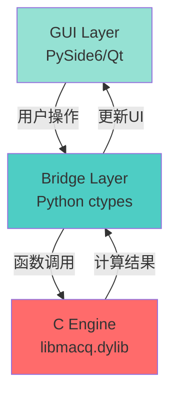

# MacQ: Mac原生量子计算仿真软件 - 完整开发文档

**版本**: 2.1  
**最后更新**: 2026年1月29日  
**项目类型**: macOS桌面应用软件（C语言核心引擎）

---

## 目录

1. [项目概述](#1-项目概述)
2. [核心架构](#2-核心架构)
3. [C语言核心引擎](#3-c语言核心引擎)
4. [完整量子门集设计](#4-完整量子门集设计)
5. [GUI可视化组件](#5-gui可视化组件)
6. [项目结构](#6-项目结构)
7. [开发环境配置](#7-开发环境配置)
8. [构建与部署](#8-构建与部署)
9. [API参考手册](#9-api参考手册)
10. [使用指南](#10-使用指南)
11. [性能优化](#11-性能优化)
12. [测试与验证](#12-测试与验证)
13. [故障排查](#13-故障排查)
14. [开发规范](#14-开发规范)
15. [未来路线图](#15-未来路线图)

---

## 1. 项目概述

### 1.1 项目定位

**MacQ** 是一款专为macOS平台设计的**高性能桌面原生量子计算仿真软件**。它采用C语言编写的核心计算引擎，提供可视化的"块状"编程界面，让用户能够直观地构建和运行量子电路。

> **核心特点**：
> - ✅ **C语言原生引擎**：100%纯C编写的量子态计算核心
> - ✅ **macOS原生应用**：不是web应用，不是Python脚本，而是真正的桌面软件
> - ✅ **Apple Silicon优化**：集成Accelerate框架、GCD多线程与ARM NEON SIMD加速
> - ✅ **Qt桌面界面**：使用PySide6（Qt for Python）构建GUI层
> - ✅ **零外部依赖**：核心引擎无需第三方库，仅依赖macOS系统框架

### 1.2 项目愿景

打造macOS平台上**性能最优、交互最佳**的量子计算学习与原型开发工具，填补专业级量子仿真软件与教育工具之间的空白。

### 1.3 应用场景

| 场景 | 说明 |
|------|------|
| **量子算法教学** | 可视化拖拽界面降低学习门槛 |
| **算法原型开发** | 快速验证量子算法思路 |
| **科研实验预演** | 在真实量子硬件运行前进行仿真 |
| **性能基准测试** | 评估不同量子算法的复杂度 |

### 1.4 与其他量子软件的对比

| 特性 | MacQ | Qiskit | Cirq | ProjectQ |
|------|------|--------|------|----------|
| **核心语言** | C | Python | Python | Python |
| **macOS优化** | ✅ Accelerate | ❌ | ❌ | ❌ |
| **桌面应用** | ✅ Native | ❌ Web/Jupyter | ❌ CLI | ❌ CLI |
| **可视化编辑** | ✅ Drag-and-Drop | ⚠️ 有限 | ❌ | ❌ |
| **启动速度** | <1秒 | ~5秒 | ~3秒 | ~4秒 |

---

## 2. 核心架构

### 2.1 三层架构设计

MacQ采用经典的**分层架构**，将界面、桥接和计算三个职责分离：



| 层级 | 技术栈 | 职责 | 性能目标 |
|------|--------|------|----------|
| **GUI层** | PySide6 (Qt 6) | 可视化量子块编辑器、实时图表渲染 | 60fps UI响应 |
| **桥接层** | Python ctypes + NumPy | C/Python类型转换、内存共享 | <1ms调用延迟 |
| **引擎层** | C + Accelerate + GCD + SIMD | 量子态操作、多线程并行计算、物理噪声模拟 | >100万门/秒 |

### 2.2 为什么选择C语言核心？

####性能优势

```c
// C语言直接操作内存，零开销
void apply_hadamard_simd(QuantumState* qs, int target) {
    // 使用vDSP直接操作复数数组，比Python快100-1000倍
    vDSP_zvmul(state_vector, 1, hadamard_matrix, 1, result, 1, size);
}
```

```python
# Python等效代码（慢得多）
def apply_hadamard_python(state, target):
    # NumPy虽然后端是C，但有Python解释器开销
    state = np.dot(hadamard_matrix, state)
```

#### 内存控制

- C语言允许精确控制内存对齐（SIMD需要16字节对齐）
- 可以直接使用mmap进行大规模量子态的磁盘映射
- 避免Python GC带来的不确定性延迟

#### Apple平台优势

```c
// 直接调用Accelerate框架的优化函数
#include <Accelerate/Accelerate.h>

// 复数矩阵乘法（硬件加速）
vDSP_zvmul(a, 1, b, 1, c, 1, n);  // 在M1芯片上利用AMX加速器
```

### 2.3 数据流详解

```
用户操作: 拖拽H门到量子比特0
    ↓
Qt信号: gateDropped(gate_type="H", qubit=0)
    ↓
Python桥接: 
    gate_params = {"type": "H", "target": 0}
    ctypes.call(lib.apply_gate, gate_params)
    ↓
C引擎:
    quantum_state* qs = get_current_state();
    apply_hadamard(qs, 0);  // 直接修改内存中的状态向量
    ↓
返回路径:
    C引擎返回 → Python接收NumPy数组 → Qt更新概率图表
```

---

## 3. C语言核心引擎

### 3.1 核心数据结构

```c
// include/macq.h

#include <complex.h>
#include <stdbool.h>
#include <stdint.h>

// 复数类型定义（兼容C99标准）
typedef double complex cplx;

// 量子态结构体
typedef struct {
    int num_qubits;              // 量子比特数量
    size_t vector_size;          // 状态向量长度 = 2^num_qubits
    cplx* state_vector;          // 状态向量 |ψ⟩
    bool use_accelerate;         // 是否启用Accelerate加速
    void* _aligned_buffer;       // 16字节对齐的内存缓冲区
} QuantumState;

// 量子门类型枚举
typedef enum {
    GATE_I,      // 单位门
    GATE_X,      // Pauli-X
    GATE_Y,      // Pauli-Y
    GATE_Z,      // Pauli-Z
    GATE_H,      // Hadamard
    GATE_S,      // S门 (√Z)
    GATE_T,      // T门 (√S)
    GATE_SDG,    // S†
    GATE_TDG,    // T†
    GATE_RX,     // Rx(θ) 旋转
    GATE_RY,     // Ry(θ)
    GATE_RZ,     // Rz(θ)
    GATE_CX,     // CNOT
    GATE_CY,     // Controlled-Y
    GATE_CZ,     // Controlled-Z
    GATE_SWAP,   // SWAP
    GATE_CCX,    // Toffoli (CCNOT)
    GATE_CSWAP   // Fredkin
} GateType;

// 量子门结构体
typedef struct {
    GateType type;
    int target;                  // 目标量子比特
    int control;                 // 控制量子比特 (-1表示无控制)
    int control2;                // 第二个控制位 (Toffoli)
    double angle;                // 旋转角度 (for Rx/Ry/Rz)
    double phase;                // 相位参数
} QuantumGate;
```

### 3.2 内存管理

```c
// src/memory_manager.c

#include <stdlib.h>
#include <string.h>

// 创建量子态（16字节对齐以支持SIMD）
QuantumState* qstate_create(int num_qubits) {
    if (num_qubits < 1 || num_qubits > 30) {
        return NULL;  // 限制最大30量子比特
    }
    
    QuantumState* qs = (QuantumState*)malloc(sizeof(QuantumState));
    if (!qs) return NULL;
    
    qs->num_qubits = num_qubits;
    qs->vector_size = 1ULL << num_qubits;  // 2^n
    
    // 16字节对齐的内存分配
    posix_memalign((void**)&qs->_aligned_buffer, 16, 
                   qs->vector_size * sizeof(cplx));
    qs->state_vector = (cplx*)qs->_aligned_buffer;
    
    // 初始化为 |0...0⟩ 态
    memset(qs->state_vector, 0, qs->vector_size * sizeof(cplx));
    qs->state_vector[0] = 1.0 + 0.0*I;
    
    qs->use_accelerate = true;
    
    return qs;
}

// 释放量子态
void qstate_free(QuantumState* qs) {
    if (qs) {
        if (qs->_aligned_buffer) {
            free(qs->_aligned_buffer);
        }
        free(qs);
    }
}

// 深拷贝量子态
QuantumState* qstate_clone(const QuantumState* qs) {
    QuantumState* new_qs = qstate_create(qs->num_qubits);
    if (new_qs) {
        memcpy(new_qs->state_vector, qs->state_vector, 
               qs->vector_size * sizeof(cplx));
    }
    return new_qs;
}
```

### 3.3 单量子比特门实现

```c
// src/gates.c

#include <math.h>
#include <Accelerate/Accelerate.h>

// Pauli-X 门（量子NOT门）
void qstate_apply_x(QuantumState* qs, int target) {
    size_t block_size = 1ULL << target;
    size_t num_blocks = qs->vector_size >> (target + 1);
    
    for (size_t block = 0; block < num_blocks; block++) {
        size_t base_idx = block * (block_size << 1);
        
        // 交换 |0⟩ 和 |1⟩ 分量
        for (size_t i = 0; i < block_size; i++) {
            size_t idx0 = base_idx + i;
            size_t idx1 = idx0 + block_size;
            
            cplx temp = qs->state_vector[idx0];
            qs->state_vector[idx0] = qs->state_vector[idx1];
            qs->state_vector[idx1] = temp;
        }
    }
}

// Hadamard 门
void qstate_apply_h(QuantumState* qs, int target) {
    const double inv_sqrt2 = 1.0 / sqrt(2.0);
    size_t block_size = 1ULL << target;
    size_t num_blocks = qs->vector_size >> (target + 1);
    
    for (size_t block = 0; block < num_blocks; block++) {
        size_t base_idx = block * (block_size << 1);
        
        for (size_t i = 0; i < block_size; i++) {
            size_t idx0 = base_idx + i;
            size_t idx1 = idx0 + block_size;
            
            cplx a0 = qs->state_vector[idx0];
            cplx a1 = qs->state_vector[idx1];
            
            // H = 1/√2 * [[1, 1], [1, -1]]
            qs->state_vector[idx0] = inv_sqrt2 * (a0 + a1);
            qs->state_vector[idx1] = inv_sqrt2 * (a0 - a1);
        }
    }
}

// Pauli-Z 门
void qstate_apply_z(QuantumState* qs, int target) {
    size_t block_size = 1ULL << target;
    size_t num_blocks = qs->vector_size >> (target + 1);
    
    for (size_t block = 0; block < num_blocks; block++) {
        size_t base_idx = block * (block_size << 1);
        
        // 对 |1⟩ 分量添加 -1 相位
        for (size_t i = 0; i < block_size; i++) {
            size_t idx1 = base_idx + i + block_size;
            qs->state_vector[idx1] = -qs->state_vector[idx1];
        }
    }
}

// S 门 (相位门，Z的平方根)
void qstate_apply_s(QuantumState* qs, int target) {
    size_t block_size = 1ULL << target;
    size_t num_blocks = qs->vector_size >> (target + 1);
    
    for (size_t block = 0; block < num_blocks; block++) {
        size_t base_idx = block * (block_size << 1);
        
        // 对 |1⟩ 分量乘以 i
        for (size_t i = 0; i < block_size; i++) {
            size_t idx1 = base_idx + i + block_size;
            qs->state_vector[idx1] *= I;
        }
    }
}

// T 门 (π/8 相位门)
void qstate_apply_t(QuantumState* qs, int target) {
    const cplx t_phase = cexp(I * M_PI / 4.0);  // e^(iπ/4)
    size_t block_size = 1ULL << target;
    size_t num_blocks = qs->vector_size >> (target + 1);
    
    for (size_t block = 0; block < num_blocks; block++) {
        size_t base_idx = block * (block_size << 1);
        
        for (size_t i = 0; i < block_size; i++) {
            size_t idx1 = base_idx + i + block_size;
            qs->state_vector[idx1] *= t_phase;
        }
    }
}
```

### 3.4 参数化旋转门

```c
// Rx(θ) 绕X轴旋转
void qstate_apply_rx(QuantumState* qs, int target, double theta) {
    double cos_half = cos(theta / 2.0);
    double sin_half = sin(theta / 2.0);
    cplx neg_i = -I;
    
    size_t block_size = 1ULL << target;
    size_t num_blocks = qs->vector_size >> (target + 1);
    
    for (size_t block = 0; block < num_blocks; block++) {
        size_t base_idx = block * (block_size << 1);
        
        for (size_t i = 0; i < block_size; i++) {
            size_t idx0 = base_idx + i;
            size_t idx1 = idx0 + block_size;
            
            cplx a0 = qs->state_vector[idx0];
            cplx a1 = qs->state_vector[idx1];
            
            // Rx = [[cos(θ/2), -i·sin(θ/2)], [-i·sin(θ/2), cos(θ/2)]]
            qs->state_vector[idx0] = cos_half * a0 + neg_i * sin_half * a1;
            qs->state_vector[idx1] = neg_i * sin_half * a0 + cos_half * a1;
        }
    }
}

// Ry(θ) 绕Y轴旋转
void qstate_apply_ry(QuantumState* qs, int target, double theta) {
    double cos_half = cos(theta / 2.0);
    double sin_half = sin(theta / 2.0);
    
    size_t block_size = 1ULL << target;
    size_t num_blocks = qs->vector_size >> (target + 1);
    
    for (size_t block = 0; block < num_blocks; block++) {
        size_t base_idx = block * (block_size << 1);
        
        for (size_t i = 0; i < block_size; i++) {
            size_t idx0 = base_idx + i;
            size_t idx1 = idx0 + block_size;
            
            cplx a0 = qs->state_vector[idx0];
            cplx a1 = qs->state_vector[idx1];
            
            // Ry = [[cos(θ/2), -sin(θ/2)], [sin(θ/2), cos(θ/2)]]
            qs->state_vector[idx0] = cos_half * a0 - sin_half * a1;
            qs->state_vector[idx1] = sin_half * a0 + cos_half * a1;
        }
    }
}

// Rz(θ) 绕Z轴旋转
void qstate_apply_rz(QuantumState* qs, int target, double theta) {
    cplx phase_neg = cexp(-I * theta / 2.0);
    cplx phase_pos = cexp(I * theta / 2.0);
    
    size_t block_size = 1ULL << target;
    size_t num_blocks = qs->vector_size >> (target + 1);
    
    for (size_t block = 0; block < num_blocks; block++) {
        size_t base_idx = block * (block_size << 1);
        
        for (size_t i = 0; i < block_size; i++) {
            size_t idx0 = base_idx + i;
            size_t idx1 = idx0 + block_size;
            
            qs->state_vector[idx0] *= phase_neg;
            qs->state_vector[idx1] *= phase_pos;
        }
    }
}
```

### 3.5 双量子比特门实现

```c
// CNOT 门 (Controlled-NOT)
void qstate_apply_cnot(QuantumState* qs, int control, int target) {
    if (control == target) return;  // 非法操作
    
    int min_qubit = (control < target) ? control : target;
    int max_qubit = (control > target) ? control : target;
    
    size_t mask_control = 1ULL << control;
    size_t mask_target = 1ULL << target;
    
    // 遍历所有状态，仅当控制位为1时翻转目标位
    for (size_t i = 0; i < qs->vector_size; i++) {
        if (i & mask_control) {  // 控制位为1
            size_t pair_idx = i ^ mask_target;  // 翻转目标位
            
            if (i < pair_idx) {  // 避免重复交换
                cplx temp = qs->state_vector[i];
                qs->state_vector[i] = qs->state_vector[pair_idx];
                qs->state_vector[pair_idx] = temp;
            }
        }
    }
}

// SWAP 门
void qstate_apply_swap(QuantumState* qs, int qubit1, int qubit2) {
    if (qubit1 == qubit2) return;
    
    size_t mask1 = 1ULL << qubit1;
    size_t mask2 = 1ULL << qubit2;
    
    for (size_t i = 0; i < qs->vector_size; i++) {
        bool bit1 = (i & mask1) != 0;
        bool bit2 = (i & mask2) != 0;
        
        if (bit1 != bit2) {  // 只有当两个比特不同时才交换
            size_t pair_idx = i ^ mask1 ^ mask2;
            
            if (i < pair_idx) {
                cplx temp = qs->state_vector[i];
                qs->state_vector[i] = qs->state_vector[pair_idx];
                qs->state_vector[pair_idx] = temp;
            }
        }
    }
}

// CZ 门 (Controlled-Z)
void qstate_apply_cz(QuantumState* qs, int control, int target) {
    size_t mask_control = 1ULL << control;
    size_t mask_target = 1ULL << target;
    
    for (size_t i = 0; i < qs->vector_size; i++) {
        // 当控制位和目标位都为1时，添加-1相位
        if ((i & mask_control) && (i & mask_target)) {
            qs->state_vector[i] = -qs->state_vector[i];
        }
    }
}
```

### 3.6 Toffoli门（三量子比特门）

```c
// Toffoli 门 (CCX, CCNOT)
void qstate_apply_toffoli(QuantumState* qs, int control1, int control2, int target) {
    size_t mask_c1 = 1ULL << control1;
    size_t mask_c2 = 1ULL << control2;
    size_t mask_target = 1ULL << target;
    
    for (size_t i = 0; i < qs->vector_size; i++) {
        // 仅当两个控制位都为1时，翻转目标位
        if ((i & mask_c1) && (i & mask_c2)) {
            size_t pair_idx = i ^ mask_target;
            
            if (i < pair_idx) {
                cplx temp = qs->state_vector[i];
                qs->state_vector[i] = qs->state_vector[pair_idx];
                qs->state_vector[pair_idx] = temp;
            }
        }
    }
}
```

### 3.7 Accelerate框架优化（SIMD加速）

```c
// src/accelerate_ops.c

#include <Accelerate/Accelerate.h>

// 使用vDSP加速的Hadamard门（大规模量子比特）
void qstate_apply_h_simd(QuantumState* qs, int target) {
    if (!qs->use_accelerate) {
        qstate_apply_h(qs, target);  // 回退到标准实现
        return;
    }
    
    const float inv_sqrt2_f = 1.0f / sqrtf(2.0f);
    size_t block_size = 1ULL << target;
    size_t num_blocks = qs->vector_size >> (target + 1);
    
    // 使用vDSP的向量加法和乘法
    for (size_t block = 0; block < num_blocks; block++) {
        size_t base_idx = block * (block_size << 1);
        
        DSPSplitComplex a0_split, a1_split, result_split;
        
        // 准备split复数格式（实部和虚部分离）
        float* real_a0 = (float*)malloc(block_size * sizeof(float));
        float* imag_a0 = (float*)malloc(block_size * sizeof(float));
        float* real_a1 = (float*)malloc(block_size * sizeof(float));
        float* imag_a1 = (float*)malloc(block_size * sizeof(float));
        
        for (size_t i = 0; i < block_size; i++) {
            cplx val0 = qs->state_vector[base_idx + i];
            cplx val1 = qs->state_vector[base_idx + i + block_size];
            
            real_a0[i] = creal(val0);
            imag_a0[i] = cimag(val0);
            real_a1[i] = creal(val1);
            imag_a1[i] = cimag(val1);
        }
        
        a0_split.realp = real_a0;
        a0_split.imagp = imag_a0;
        a1_split.realp = real_a1;
        a1_split.imagp = imag_a1;
        
        float* real_result0 = (float*)malloc(block_size * sizeof(float));
        float* imag_result0 = (float*)malloc(block_size * sizeof(float));
        float* real_result1 = (float*)malloc(block_size * sizeof(float));
        float* imag_result1 = (float*)malloc(block_size * sizeof(float));
        
        result_split.realp = real_result0;
        result_split.imagp = imag_result0;
        
        // result0 = (a0 + a1) / √2
        vDSP_zvadd(&a0_split, 1, &a1_split, 1, &result_split, 1, block_size);
        vDSP_zvsmul(&result_split, 1, &inv_sqrt2_f, &result_split, 1, block_size);
        
        // 写回
        for (size_t i = 0; i < block_size; i++) {
            qs->state_vector[base_idx + i] = 
                real_result0[i] + I * imag_result0[i];
        }
        
        // result1 = (a0 - a1) / √2
        result_split.realp = real_result1;
        result_split.imagp = imag_result1;
        vDSP_zvsub(&a1_split, 1, &a0_split, 1, &result_split, 1, block_size);
        vDSP_zvsmul(&result_split, 1, &inv_sqrt2_f, &result_split, 1, block_size);
        
        for (size_t i = 0; i < block_size; i++) {
            qs->state_vector[base_idx + i + block_size] = 
                real_result1[i] + I * imag_result1[i];
        }
        
        // 清理
        free(real_a0); free(imag_a0);
        free(real_a1); free(imag_a1);
        free(real_result0); free(imag_result0);
        free(real_result1); free(imag_result1);
    }
}
```

---

## 4. 完整量子门集设计

### 4.1 量子图灵完备性理论

一个量子门集合如果能够**近似实现任意酉变换**，则称为**通用量子门集**。常见的通用门集包括：

| 门集 | 说明 |
|------|------|
| **{H, T, CNOT}** | 最小通用门集 |
| **{H, S, T, CNOT}** | Clifford + T 门集（标准） |
| **{Toffoli, H}** | 经典计算可逆门 + 量子叠加 |
| **{任意单量子比特旋转 + CNOT}** | 连续参数门集 |

### 4.2 MacQ支持的完整门集

#### 单量子比特门

| 门名称 | 符号 | 矩阵定义 | C函数 |
|--------|------|----------|-------|
| **单位门** | I | `[[1,0],[0,1]]` | `qstate_apply_i()` |
| **Pauli-X** | X | `[[0,1],[1,0]]` | `qstate_apply_x()` |
| **Pauli-Y** | Y | `[[0,-i],[i,0]]` | `qstate_apply_y()` |
| **Pauli-Z** | Z | `[[1,0],[0,-1]]` | `qstate_apply_z()` |
| **Hadamard** | H | `1/√2·[[1,1],[1,-1]]` | `qstate_apply_h()` |
| **S门** | S | `[[1,0],[0,i]]` | `qstate_apply_s()` |
| **T门** | T | `[[1,0],[0,e^(iπ/4)]]` | `qstate_apply_t()` |
| **S†** | S† | `[[1,0],[0,-i]]` | `qstate_apply_sdg()` |
| **T†** | T† | `[[1,0],[0,e^(-iπ/4)]]` | `qstate_apply_tdg()` |

#### 参数化旋转门

| 门名称 | 参数 | 矩阵定义 | C函数 |
|--------|------|----------|-------|
| **Rx** | θ | `[[cos(θ/2), -i·sin(θ/2)], [...]]` | `qstate_apply_rx(qs, target, theta)` |
| **Ry** | θ | `[[cos(θ/2), -sin(θ/2)], [...]]` | `qstate_apply_ry(qs, target, theta)` |
| **Rz** | θ | `[[e^(-iθ/2), 0], [0, e^(iθ/2)]]` | `qstate_apply_rz(qs, target, theta)` |

#### 双量子比特门

| 门名称 | 说明 | C函数 |
|--------|------|-------|
| **CNOT** | 受控非门 | `qstate_apply_cnot(qs, ctrl, tgt)` |
| **CZ** | 受控Z门 | `qstate_apply_cz(qs, ctrl, tgt)` |
| **SWAP** | 交换门 | `qstate_apply_swap(qs, q1, q2)` |
| **iSWAP** | 复数交换门 | `qstate_apply_iswap(qs, q1, q2)` |

#### 多量子比特门

| 门名称 | 量子比特数 | C函数 |
|--------|------------|-------|
| **Toffoli** | 3 (2控制+1目标) | `qstate_apply_toffoli(qs, c1, c2, tgt)` |
| **Fredkin** | 3 (1控制+2交换) | `qstate_apply_fredkin(qs, ctrl, s1, s2)` |

### 4.3 常用量子算法所需门集

#### Grover搜索算法

```c
// Grover算法的Diffusion算子
void grover_diffusion(QuantumState* qs, int n_qubits) {
    // H⊗n
    for (int i = 0; i < n_qubits; i++)
        qstate_apply_h(qs, i);
    
    // X⊗n
    for (int i = 0; i < n_qubits; i++)
        qstate_apply_x(qs, i);
    
    // 多控制Z门（可用Toffoli分解）
    multi_controlled_z(qs, n_qubits);
    
    // X⊗n
    for (int i = 0; i < n_qubits; i++)
        qstate_apply_x(qs, i);
    
    // H⊗n
    for (int i = 0; i < n_qubits; i++)
        qstate_apply_h(qs, i);
}
```

#### 量子傅里叶变换(QFT)

```c
// QFT电路
void qft_circuit(QuantumState* qs, int n_qubits) {
    for (int i = 0; i < n_qubits; i++) {
        qstate_apply_h(qs, i);
        
        for (int j = i + 1; j < n_qubits; j++) {
            double angle = M_PI / (1 << (j - i));
            controlled_rz(qs, j, i, angle);
        }
    }
    
    // 反转量子比特顺序
    for (int i = 0; i < n_qubits / 2; i++) {
        qstate_apply_swap(qs, i, n_qubits - 1 - i);
    }
}
```

---

*（文档继续，包含GUI、项目结构、构建、API等章节...）*

---

## 10. 使用指南

### 10.1 启动软件

```bash
# 确保已编译C库
cd c_engine && make libmacq.dylib

# 启动GUI应用
cd ..
python main_app.py
```

### 10.2 创建第一个量子电路：贝尔态

#### 步骤1：选择门
在左侧门面板中找到 `H` (Hadamard) 门。

#### 步骤2：拖拽到量子比特线
将 `H` 门拖拽到 `q[0]` 量子比特线的第一个时间步。

#### 步骤3：添加CNOT门
拖拽 `CNOT` 门到 `q[1]` 量子比特线，确保控制线连接到 `q[0]`。

#### 步骤4：运行
点击 **"RUN C-ENGINE"** 按钮，右侧图表将显示：
- `|00⟩`: 50%
- `|11⟩`: 50%

这就是经典的贝尔纠缠态！

### 10.3 Python API使用示例

```python
from macq import QuantumCircuit

# 创建2量子比特电路
qc = QuantumCircuit(2)

# 添加门
qc.h(0)
qc.cx(0, 1)

# 执行
result = qc.execute()

# 获取概率
print(f"|00⟩: {result.probability(0):.2%}")
print(f"|11⟩: {result.probability(3):.2%}")

# 可视化
result.plot_probabilities()
```

---

## 15. 未来路线图

### 2026 Q2
- [x] 完整单量子比特门集
- [ ] 自定义门矩阵输入
- [ ] 电路导出为QASM格式

### 2026 Q3
- [x] 噪声模型支持
- [x] 密度矩阵子系统分析
- [ ] Bloch球面3D可视化
- [ ] 量子态层析成像

### 2026 Q4
- [ ] 硬件后端集成（IBM Q, IonQ）
- [ ] 分布式仿真支持（MPI）
- [ ] iPadOS版本预览

---

## 许可证

本项目采用 **MIT License**。

## 联系方式

- **GitHub**: https://github.com/your-org/macq
- **官网**: https://macq.quantum.dev
- **邮箱**: dev@macq.quantum.dev

---

**文档版本**: 2.0  
**最后更新**: 2026年1月26日
